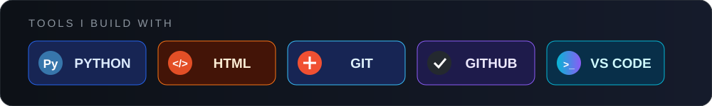
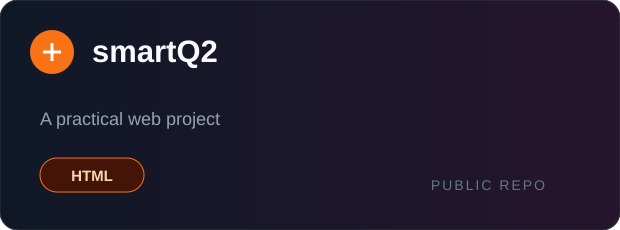
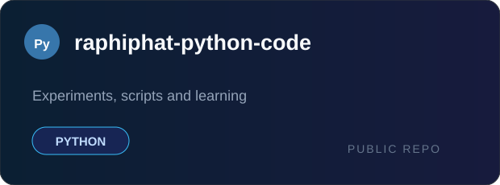
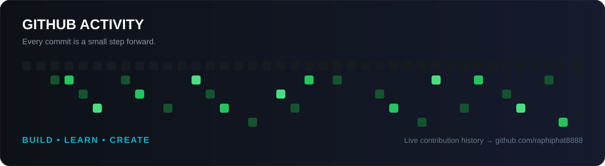

  

  
  

## Hey, I'm Takt 👋

I enjoy turning ideas into working projects — learning as I build and improving one commit at a time.

- 🐍 Building and experimenting with **Python**
- 🌐 Exploring **web development** with HTML
- 🎙️ Curious about **voice technology** and useful digital tools
- ⚡ Motto: **Build • Learn • Create**

## Tech stack

  

## Featured work

  
  

## GitHub activity

  

---

  Thanks for stopping by. Feel free to explore my repositories and follow along 🚀

